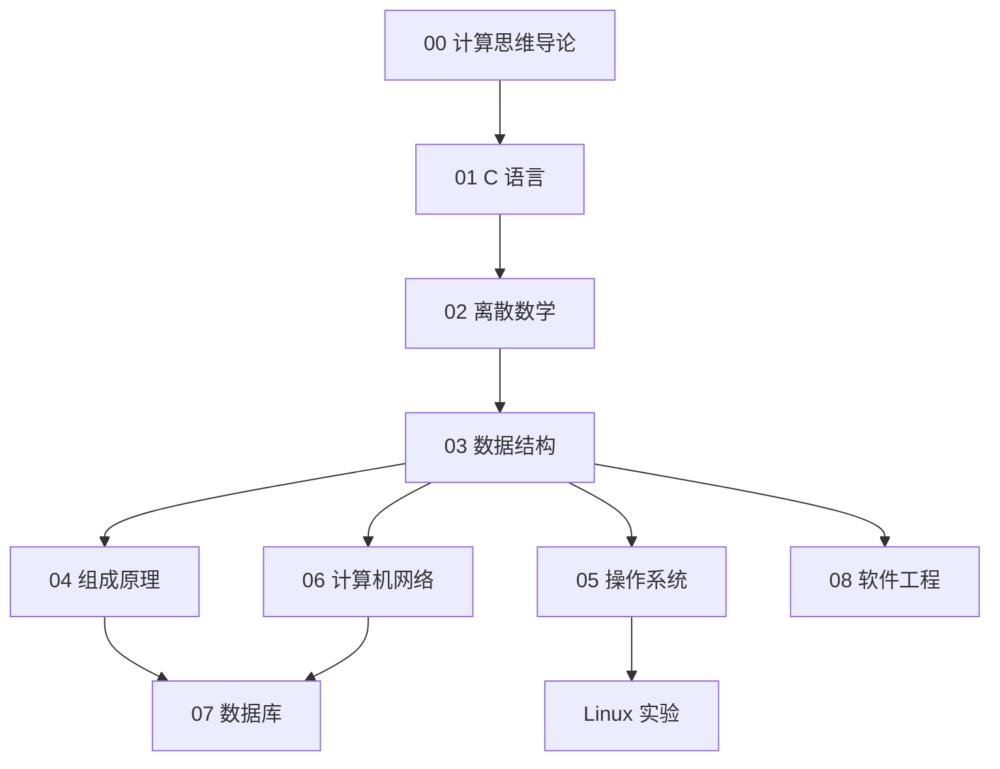

# 计算机课程地图

```mermaid
flowchart TD
  B0[00 计算思维导论] --> B1[01 C 语言]
  B1 --> B2[02 离散数学]
  B2 --> B3[03 数据结构]
  B3 --> B5a[04 组成原理]
  B3 --> B5b[05 操作系统]
  B3 --> B5c[06 计算机网络]
  B5b --> Lx[Linux 实验]
  B5a --> B6a[07 数据库]
  B5c --> B6a
  B3 --> B6b[08 软件工程]
```

当前主推：[[01 程序设计-C语言]]（并行短扫 [[00 计算思维导论]]）。

总方案与高数/英语/大物策略仍在 [[转专业/计科本科对齐学习方案（南工程·中国大学MOOC）]]。
